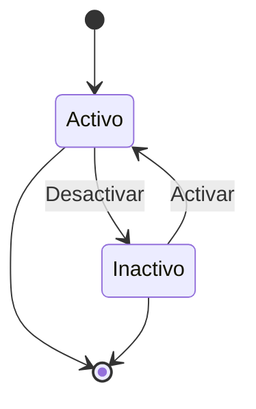
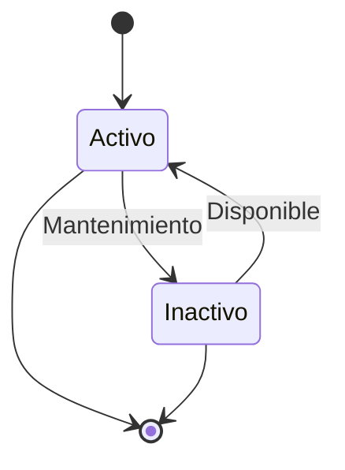
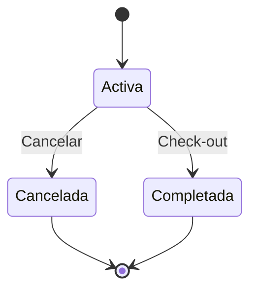

# 🔍 API Reference - StayHub Manager

## 📋 Información General

StayHub Manager expone una API REST completa para la gestión de hoteles, habitaciones y reservas. La API sigue los estándares REST, utiliza JSON como formato de intercambio y está completamente documentada con OpenAPI/Swagger.

### 🌐 Base URL
```
# Desarrollo
http://localhost:8080/api/v1

# Producción  
https://api.stayhub.com/api/v1
```

### 📄 Documentación Interactiva
- **Swagger UI**: `{baseUrl}/swagger`
- **OpenAPI Spec**: `{baseUrl}/swagger/v1/swagger.json`

## 🔐 Autenticación

### 🎫 API Key (Header)
```http
Authorization: Bearer {your-api-key}
```

### 📊 Rate Limiting
- **Límite**: 1000 requests/hour por API key
- **Headers de respuesta**:
  ```http
  X-RateLimit-Limit: 1000
  X-RateLimit-Remaining: 999
  X-RateLimit-Reset: 1640995200
  ```

## 📝 Formato de Respuesta

### ✅ Respuesta Exitosa
```json
{
  "success": true,
  "data": {
    // Datos de respuesta específicos del endpoint
  },
  "idTransaccion": "abc-123-def-456",
  "timestamp": "2024-01-15T10:30:00Z"
}
```

### ❌ Respuesta de Error
```json
{
  "success": false,
  "mensajeError": "Descripción del error",
  "codigoError": "BUSINESS_RULE_VIOLATION",
  "codigoEstado": 400,
  "idTransaccion": "abc-123-def-456",
  "timestamp": "2024-01-15T10:30:00Z",
  "detalles": {
    "regla": "BR-02",
    "campo": "fechaEntrada"
  }
}
```

## 🏨 Hoteles API

### 📋 Listar Hoteles

```http
GET /hoteles?pageNumber=1&pageSize=10&searchTerm=plaza
```

#### Parámetros de Query
| Parámetro | Tipo | Requerido | Descripción | Default |
|-----------|------|-----------|-------------|---------|
| `pageNumber` | int | ❌ | Número de página | 1 |
| `pageSize` | int | ❌ | Elementos por página | 10 |
| `searchTerm` | string | ❌ | Término de búsqueda | - |

#### Respuesta 200 OK
```json
{
  "success": true,
  "data": {
    "items": [
      {
        "hotelId": 1,
        "nombre": "Hotel Plaza",
        "direccion": "Calle Gran Vía 123",
        "ciudad": "Madrid",
        "telefono": "+34-91-123-4567",
        "email": "info@hotelplaza.com",
        "activo": true,
        "fechaCreacion": "2024-01-01T10:00:00Z"
      }
    ],
    "pageNumber": 1,
    "pageSize": 10,
    "totalPages": 5,
    "totalRecords": 47,
    "hasPreviousPage": false,
    "hasNextPage": true
  },
  "idTransaccion": "abc-123-def"
}
```

### 🔍 Obtener Hotel por ID

```http
GET /hoteles/{hotelId}
```

#### Parámetros de Ruta
| Parámetro | Tipo | Descripción |
|-----------|------|-------------|
| `hotelId` | int | ID único del hotel |

#### Respuestas
- **200 OK**: Hotel encontrado
- **404 Not Found**: Hotel no existe

```json
{
  "success": true,
  "data": {
    "hotelId": 1,
    "nombre": "Hotel Plaza",
    "direccion": "Calle Gran Vía 123",
    "ciudad": "Madrid",
    "telefono": "+34-91-123-4567",
    "email": "info@hotelplaza.com",
    "activo": true,
    "fechaCreacion": "2024-01-01T10:00:00Z"
  },
  "idTransaccion": "xyz-789-abc"
}
```

### ➕ Crear Hotel

```http
POST /hoteles
Content-Type: application/json
```

#### Request Body
```json
{
  "nombre": "Hotel Costa Brava",
  "direccion": "Paseo Marítimo 45",
  "ciudad": "Barcelona",
  "telefono": "+34-93-765-4321",
  "email": "reservas@hotelcosta.com"
}
```

#### Validaciones
| Campo | Reglas |
|-------|--------|
| `nombre` | Requerido, 2-100 caracteres |
| `direccion` | Requerido, 5-200 caracteres |
| `ciudad` | Requerido, 2-50 caracteres |
| `telefono` | Requerido, formato válido |
| `email` | Requerido, email válido |

#### Respuestas
- **201 Created**: Hotel creado exitosamente
- **400 Bad Request**: Datos inválidos

### ✏️ Actualizar Hotel

```http
PUT /hoteles/{hotelId}
Content-Type: application/json
```

#### Request Body
```json
{
  "hotelId": 1,
  "nombre": "Hotel Plaza Premium",
  "direccion": "Calle Gran Vía 123",
  "ciudad": "Madrid",
  "telefono": "+34-91-123-4567",
  "email": "info@hotelplazapremium.com"
}
```

#### Respuestas
- **200 OK**: Hotel actualizado
- **400 Bad Request**: Datos inválidos
- **404 Not Found**: Hotel no existe

### 🔄 Cambiar Estado de Hotel

```http
PATCH /hoteles/{hotelId}/estado
Content-Type: application/json
```

#### Request Body
```json
{
  "activo": false
}
```

#### Respuestas
- **200 OK**: Estado actualizado
- **404 Not Found**: Hotel no existe

---

## 🏠 Habitaciones API

### 📋 Listar Habitaciones

```http
GET /habitaciones?pageNumber=1&pageSize=10&hotelId=1
```

#### Parámetros de Query
| Parámetro | Tipo | Requerido | Descripción |
|-----------|------|-----------|-------------|
| `pageNumber` | int | ❌ | Número de página |
| `pageSize` | int | ❌ | Elementos por página |
| `hotelId` | int | ❌ | Filtrar por hotel |

#### Respuesta 200 OK
```json
{
  "success": true,
  "data": {
    "items": [
      {
        "habitacionId": 1,
        "hotelId": 1,
        "numeroHabitacion": "101",
        "tipoHabitacion": "Doble",
        "capacidad": 2,
        "tarifaNoche": 120.00,
        "descripcion": "Habitación doble con vista al mar",
        "estado": "Activo",
        "fechaCreacion": "2024-01-01T10:00:00Z"
      }
    ],
    "pageNumber": 1,
    "pageSize": 10,
    "totalPages": 3,
    "totalRecords": 25
  },
  "idTransaccion": "def-456-ghi"
}
```

### 🔍 Obtener Habitación por ID

```http
GET /habitaciones/{habitacionId}
```

### 🏨 Habitaciones por Hotel

```http
GET /habitaciones/hotel/{hotelId}
```

### 📅 Consultar Disponibilidad

```http
POST /habitaciones/disponibilidad
Content-Type: application/json
```

#### Request Body
```json
{
  "hotelId": 1,
  "fechaEntrada": "2024-02-15",
  "fechaSalida": "2024-02-18",
  "cantidadHuespedes": 2
}
```

#### Respuesta 200 OK
```json
{
  "success": true,
  "data": [
    {
      "habitacionId": 1,
      "numeroHabitacion": "101",
      "tipoHabitacion": "Doble",
      "capacidad": 2,
      "tarifaNoche": 120.00,
      "descripcion": "Habitación doble con vista al mar"
    },
    {
      "habitacionId": 3,
      "numeroHabitacion": "103",
      "tipoHabitacion": "Suite",
      "capacidad": 4,
      "tarifaNoche": 200.00,
      "descripcion": "Suite con jacuzzi"
    }
  ],
  "idTransaccion": "ghi-789-jkl"
}
```

### ➕ Crear Habitación

```http
POST /habitaciones
Content-Type: application/json
```

#### Request Body
```json
{
  "hotelId": 1,
  "numeroHabitacion": "205",
  "tipoHabitacion": "Suite",
  "capacidad": 4,
  "tarifaNoche": 250.00,
  "descripcion": "Suite presidencial con terraza"
}
```

#### Tipos de Habitación
- `Simple`
- `Doble`
- `Triple`
- `Familiar`
- `Suite`

---

## 📅 Reservas API

### 📋 Listar Reservas

```http
GET /reservas?pageNumber=1&pageSize=10&hotelId=1&habitacionId=5
```

#### Parámetros de Query
| Parámetro | Tipo | Descripción |
|-----------|------|-------------|
| `pageNumber` | int | Número de página |
| `pageSize` | int | Elementos por página |
| `hotelId` | int | Filtrar por hotel |
| `habitacionId` | int | Filtrar por habitación |

### 🔍 Obtener Reserva por ID

```http
GET /reservas/{reservaId}
```

#### Respuesta 200 OK
```json
{
  "success": true,
  "data": {
    "reservaId": 1,
    "hotelId": 1,
    "habitacionId": 1,
    "huespedNombre": "Juan Pérez",
    "huespedDocumento": "12345678A",
    "huespedTelefono": "+34-600-123-456",
    "huespedEmail": "juan.perez@email.com",
    "fechaEntrada": "2024-02-15",
    "fechaSalida": "2024-02-18",
    "cantidadHuespedes": 2,
    "valorNoche": 120.00,
    "totalReserva": 360.00,
    "estadoReserva": "Activa",
    "fechaCreacion": "2024-01-15T10:30:00Z",
    "fechaCancelacion": null
  },
  "idTransaccion": "jkl-123-mno"
}
```

### 🏨 Reservas por Hotel

```http
GET /reservas/hotel/{hotelId}
```

### ➕ Crear Reserva

```http
POST /reservas
Content-Type: application/json
```

#### Request Body
```json
{
  "hotelId": 1,
  "habitacionId": 1,
  "huespedNombre": "María García",
  "huespedDocumento": "87654321B",
  "huespedTelefono": "+34-600-987-654",
  "huespedEmail": "maria.garcia@email.com",
  "fechaEntrada": "2024-03-10",
  "fechaSalida": "2024-03-13",
  "cantidadHuespedes": 1
}
```

#### Validaciones Aplicadas
- **BR-01**: `fechaSalida` > `fechaEntrada`
- **BR-02**: Sin overbooking
- **BR-03**: `cantidadHuespedes` ≤ capacidad habitación
- **BR-04**: Habitación debe estar activa
- **BR-05**: `totalReserva` calculado automáticamente

#### Respuestas
- **201 Created**: Reserva creada
- **400 Bad Request**: Violación de reglas de negocio
- **404 Not Found**: Hotel o habitación no existe

```json
{
  "success": true,
  "data": {
    "reservaId": 15,
    "totalReserva": 360.00,
    "estadoReserva": "Activa"
  },
  "idTransaccion": "mno-456-pqr"
}
```

### ❌ Cancelar Reserva

```http
POST /reservas/{reservaId}/cancelar
```

#### Respuestas
- **200 OK**: Reserva cancelada (BR-06: soft delete)
- **400 Bad Request**: Reserva ya cancelada
- **404 Not Found**: Reserva no existe

---

## 🚨 Códigos de Error

### 4xx Client Errors

| Código | Error | Descripción |
|--------|-------|-------------|
| **400** | `INVALID_REQUEST` | Datos de entrada inválidos |
| **400** | `BUSINESS_RULE_VIOLATION` | Violación de reglas BR-01 a BR-06 |
| **401** | `UNAUTHORIZED` | API key inválida o ausente |
| **403** | `FORBIDDEN` | Permisos insuficientes |
| **404** | `NOT_FOUND` | Recurso no encontrado |
| **409** | `CONFLICT` | Conflicto con estado actual |
| **422** | `VALIDATION_ERROR` | Error de validación |
| **429** | `RATE_LIMIT_EXCEEDED` | Límite de requests excedido |

### 5xx Server Errors

| Código | Error | Descripción |
|--------|-------|-------------|
| **500** | `INTERNAL_SERVER_ERROR` | Error interno del servidor |
| **502** | `BAD_GATEWAY` | Error de gateway |
| **503** | `SERVICE_UNAVAILABLE` | Servicio temporalmente no disponible |
| **504** | `GATEWAY_TIMEOUT` | Timeout de gateway |

### 📋 Códigos de Reglas de Negocio

| Código | Regla | Descripción |
|--------|-------|-------------|
| `INVALID_CHECK_OUT_DATE` | BR-01 | Fecha salida ≤ fecha entrada |
| `OVERBOOKING_DETECTED` | BR-02 | Conflicto de fechas |
| `CAPACIDAD_EXCEDIDA` | BR-03 | Exceso de huéspedes |
| `HABITACION_INACTIVA` | BR-04 | Habitación no disponible |
| `RESERVA_YA_CANCELADA` | BR-06 | Reserva previamente cancelada |

---

## 🔄 Estados y Transiciones

### 🏨 Estados de Hotel


### 🏠 Estados de Habitación


### 📅 Estados de Reserva


---

## 📊 Paginación

### 🔢 Estructura de Respuesta
```json
{
  "items": [...],
  "pageNumber": 1,
  "pageSize": 10,
  "totalPages": 5,
  "totalRecords": 47,
  "hasPreviousPage": false,
  "hasNextPage": true
}
```

### ⚙️ Parámetros Soportados
- `pageNumber`: 1-N (default: 1)
- `pageSize`: 1-100 (default: 10)

---

## 🎯 Ejemplos de Uso

### 📝 Flujo Completo: Crear Reserva

```bash
# 1. Buscar hoteles
curl "http://localhost:8080/api/v1/hoteles?searchTerm=plaza"

# 2. Consultar disponibilidad
curl -X POST "http://localhost:8080/api/v1/habitaciones/disponibilidad" \
  -H "Content-Type: application/json" \
  -d '{
    "hotelId": 1,
    "fechaEntrada": "2024-02-15",
    "fechaSalida": "2024-02-18", 
    "cantidadHuespedes": 2
  }'

# 3. Crear reserva
curl -X POST "http://localhost:8080/api/v1/reservas" \
  -H "Content-Type: application/json" \
  -d '{
    "hotelId": 1,
    "habitacionId": 1,
    "huespedNombre": "Juan Pérez",
    "huespedDocumento": "12345678A",
    "huespedEmail": "juan@email.com",
    "fechaEntrada": "2024-02-15",
    "fechaSalida": "2024-02-18",
    "cantidadHuespedes": 2
  }'
```

### 🔍 Consultas Avanzadas

```bash
# Reservas paginadas con filtros
curl "http://localhost:8080/api/v1/reservas?pageNumber=1&pageSize=5&hotelId=1"

# Habitaciones de un hotel específico
curl "http://localhost:8080/api/v1/habitaciones/hotel/1"

# Hoteles con búsqueda
curl "http://localhost:8080/api/v1/hoteles?searchTerm=madrid&pageSize=20"
```

---

## 🛠️ SDKs y Herramientas

### 📱 Cliente JavaScript/TypeScript
```bash
npm install @stayhub/api-client
```

```typescript
import { StayHubClient } from '@stayhub/api-client';

const client = new StayHubClient({
  baseUrl: 'https://api.stayhub.com/api/v1',
  apiKey: 'your-api-key'
});

const hoteles = await client.hoteles.getAll({
  pageNumber: 1,
  pageSize: 10
});
```

### 🐍 Cliente Python
```bash
pip install stayhub-api-client
```

```python
from stayhub_client import StayHubClient

client = StayHubClient(
    base_url='https://api.stayhub.com/api/v1',
    api_key='your-api-key'
)

hoteles = client.hoteles.get_all(page_number=1, page_size=10)
```

### 📋 Postman Collection
Descarga la colección completa: [StayHub.postman_collection.json](./postman/StayHub.postman_collection.json)

---

## 🎯 Rate Limiting

### 📊 Límites por Endpoint

| Endpoint | Límite | Ventana |
|----------|--------|---------|
| `GET *` | 1000/hour | Sliding |
| `POST *` | 500/hour | Sliding |
| `PUT *` | 200/hour | Sliding |
| `DELETE *` | 100/hour | Sliding |

### 🔄 Headers de Rate Limit
```http
X-RateLimit-Limit: 1000
X-RateLimit-Remaining: 999
X-RateLimit-Reset: 1640995200
```

---