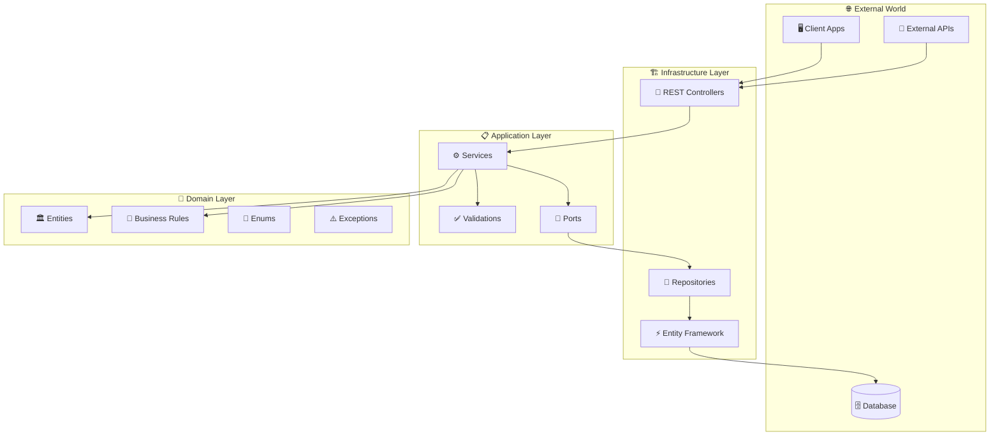
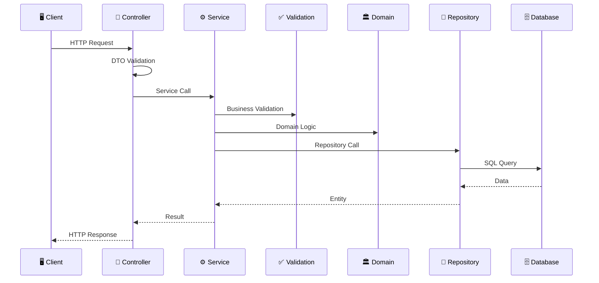
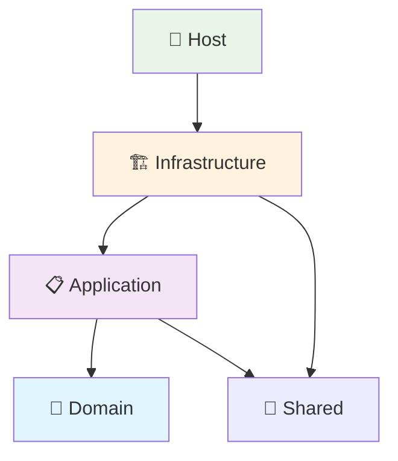

# 🏗️ Arquitectura del Sistema

## 📐 Visión General

StayHub Manager implementa una **Arquitectura Hexagonal** (también conocida como Ports & Adapters), diseñada para maximizar la separación de responsabilidades, testabilidad y mantenibilidad del código.



## 🎯 Principios Arquitecturales

### 🔄 Inversión de Dependencias
```csharp
// ❌ Dependencia directa (malo)
public class ReservaService
{
    private readonly SqlServerReservaRepository _repository;
}

// ✅ Inversión de dependencias (bueno)
public class ReservaService : IReservaService
{
    private readonly IReservaRepository _repository;
}
```

### 🧩 Separación de Responsabilidades
- **Domain**: Lógica de negocio pura, sin dependencias externas
- **Application**: Orquestación y casos de uso
- **Infrastructure**: Detalles de implementación (DB, HTTP, etc.)

### 🔒 Encapsulación
- Las capas internas no conocen las externas
- Comunicación solo através de interfaces (puertos)
- Bajo acoplamiento, alta cohesión

## 📁 Estructura del Proyecto

### 🗂️ Organización de Directorios

```
src/
├── 💎 StayHub.Domain/                    # Núcleo de negocio
│   ├── Entities/                         # Entidades de dominio
│   │   ├── Hotel.cs
│   │   ├── Habitacion.cs
│   │   └── Reserva.cs
│   ├── Enums/                           # Enumeraciones
│   │   ├── Estado.cs
│   │   ├── EstadoReserva.cs
│   │   └── TipoHabitacion.cs
│   ├── Exceptions/                      # Excepciones de dominio
│   │   ├── BusinessException.cs
│   │   ├── EntityNotFoundException.cs
│   │   └── DatabaseException.cs
│   └── Constants/                       # Constantes por dominio
│       └── Reserva/
│           ├── ReservaErrorCodes.cs
│           ├── ReservaErrorMessages.cs
│           └── ReservaEntityNames.cs
│
├── 📋 StayHub.Application/               # Lógica de aplicación  
│   ├── Services/                        # Servicios de aplicación
│   │   ├── HotelService.cs
│   │   ├── HabitacionService.cs
│   │   └── ReservaService.cs
│   ├── Ports/                          # Interfaces (puertos)
│   │   ├── In/                         # Puertos de entrada
│   │   │   └── Services/
│   │   │       ├── IHotelService.cs
│   │   │       ├── IHabitacionService.cs
│   │   │       └── IReservaService.cs
│   │   └── Out/                        # Puertos de salida
│   │       ├── Database/               # Persistencia
│   │       │   ├── IHotelRepository.cs
│   │       │   ├── IHabitacionRepository.cs
│   │       │   └── IReservaRepository.cs
│   │       └── Traceability/           # Logs y trazabilidad
│   │           └── ITraceability.cs
│   └── Rules/                          # Validaciones y reglas
│       ├── HotelValidations.cs
│       ├── HabitacionValidations.cs
│       └── ReservaValidations.cs
│
├── 🏗️ StayHub.Infrastructure/            # Detalles de implementación
│   ├── In/                             # Adaptadores de entrada
│   │   └── Rest/                       # REST API
│   │       ├── Controllers/
│   │       │   ├── HotelesController.cs
│   │       │   ├── HabitacionesController.cs
│   │       │   └── ReservasController.cs
│   │       ├── Dtos/                   # Data Transfer Objects
│   │       ├── Mappers/                # Conversión DTO ↔ Entity
│   │       ├── Middlewares/            # Middlewares HTTP
│   │       └── Extensions/             # Extension methods
│   └── Out/                            # Adaptadores de salida
│       ├── Database/                   # Persistencia con EF Core
│       │   └── EfCore/
│       │       ├── Adapters/           # Implementación repositories
│       │       ├── Configurations/     # EF Configurations
│       │       └── StayHubDbContext.cs
│       └── Traceability/              # Implementación logging
│           └── SerilogTraceability.cs
│
├── 🔗 StayHub.Shared/                    # Componentes compartidos
│   └── Types/                          # Tipos comunes
│       ├── Pagination.cs
│       └── OperationResult.cs
│
└── 🚀 StayHub.Host/                      # Aplicación principal
    ├── Program.cs                      # Punto de entrada
    ├── appsettings.json               # Configuración
    └── Dockerfile                     # Containerización
```

## 🔄 Flujo de Datos

### 📤 Request Flow (Entrada)


### 📥 Dependency Flow (Dependencias)


## 🔧 Patrones Implementados

### 🏭 Repository Pattern
```csharp
// Puerto (Application Layer)
public interface IHotelRepository
{
    Task<OperationResult<Hotel?>> GetByIdAsync(int hotelId);
    Task<OperationResult<List<Hotel>>> GetAllAsync();
    Task<OperationResult<Hotel>> CreateAsync(Hotel hotel);
}

// Adaptador (Infrastructure Layer)  
public class HotelEfAdapter : IHotelRepository
{
    private readonly StayHubDbContext _context;

    public async Task<OperationResult<Hotel?>> GetByIdAsync(int hotelId)
    {
        // Implementación con Entity Framework
    }
}
```

### 🎭 Service Layer Pattern
```csharp
public class HotelService : IHotelService
{
    private readonly IHotelRepository _repository;
    private readonly ITraceability _traceability;

    public async Task<Hotel> CreateAsync(Hotel hotel, string transactionId)
    {
        // 1. Logging de entrada
        await _traceability.TraceInAsync(transactionId, ...);

        try
        {
            // 2. Validaciones de negocio
            HotelValidations.ValidateHotelData(hotel);

            // 3. Lógica de dominio
            var result = await _repository.CreateAsync(hotel);

            // 4. Logging de salida
            await _traceability.TraceOutAsync(transactionId, ...);

            return result.Data;
        }
        catch (Exception ex)
        {
            // 5. Logging de errores
            await _traceability.TraceErrorAsync(transactionId, ex);
            throw;
        }
    }
}
```

### 🎯 DTO Pattern
```csharp
// Request DTO
public class CreateHotelRequest
{
    public string Nombre { get; set; } = string.Empty;
    public string Direccion { get; set; } = string.Empty;
    public string Ciudad { get; set; } = string.Empty;
    public string Telefono { get; set; } = string.Empty;
    public string Email { get; set; } = string.Empty;
}

// Response DTO
public class HotelDto
{
    public int HotelId { get; set; }
    public string Nombre { get; set; } = string.Empty;
    public string Ciudad { get; set; } = string.Empty;
    public bool Activo { get; set; }
    public DateTime FechaCreacion { get; set; }
}
```

### 🗺️ Mapper Pattern
```csharp
public static class HotelMapper
{
    public static Hotel ToEntity(CreateHotelRequest request)
    {
        return new Hotel
        {
            Nombre = request.Nombre?.Trim(),
            Direccion = request.Direccion?.Trim(),
            Ciudad = request.Ciudad?.Trim(),
            Telefono = request.Telefono?.Trim(),
            Email = request.Email?.Trim().ToLowerInvariant(),
            Activo = true,
            FechaCreacion = DateTime.UtcNow
        };
    }

    public static HotelDto ToDto(Hotel hotel)
    {
        return new HotelDto
        {
            HotelId = hotel.HotelId,
            Nombre = hotel.Nombre,
            Ciudad = hotel.Ciudad,
            Activo = hotel.Activo,
            FechaCreacion = hotel.FechaCreacion
        };
    }
}
```

## 🔍 Inyección de Dependencias

### 📦 Configuración de Servicios
```csharp
// Program.cs
var builder = WebApplication.CreateBuilder(args);

// Domain Services (sin dependencias externas)
// Registración automática via reflexión o manual

// Application Services
builder.Services.AddScoped<IHotelService, HotelService>();
builder.Services.AddScoped<IHabitacionService, HabitacionService>();
builder.Services.AddScoped<IReservaService, ReservaService>();

// Infrastructure Services
builder.Services.AddScoped<IHotelRepository, HotelEfAdapter>();
builder.Services.AddScoped<IHabitacionRepository, HabitacionEfAdapter>();
builder.Services.AddScoped<IReservaRepository, ReservaEfAdapter>();

// Cross-cutting Concerns
builder.Services.AddScoped<ITraceability, SerilogTraceability>();

// Entity Framework
builder.Services.AddDbContext<StayHubDbContext>(options =>
    options.UseSqlServer(connectionString));
```

## 📊 Gestión de Estados

### 🔄 Estado de Entidades
```csharp
public enum Estado
{
    Activo = 1,
    Inactivo = 0
}

public enum EstadoReserva  
{
    Activa = 1,
    Cancelada = 0,
    Completada = 2
}
```

### 🎯 Patrón State Machine
Las entidades mantienen estados consistentes a través de:
- Validaciones en setters
- Métodos específicos para cambio de estado
- Auditoría de transiciones

## 🔐 Manejo de Errores

### 🏗️ Jerarquía de Excepciones
```csharp
// Base exception
public abstract class StayHubException : Exception
{
    public string ErrorCode { get; }
    public int HttpStatusCode { get; }
}

// Business logic exceptions
public class BusinessException : StayHubException
{
    public string RuleCode { get; }
}

// Not found exceptions
public class EntityNotFoundException : StayHubException
{
    public string EntityName { get; }
    public object EntityId { get; }
}
```

### 🛡️ Global Exception Handling
```csharp
public class GlobalExceptionHandlingMiddleware
{
    public async Task InvokeAsync(HttpContext context)
    {
        var transactionId = Guid.NewGuid().ToString();
        context.Items["TransactionId"] = transactionId;

        try
        {
            await _next(context);
        }
        catch (Exception ex)
        {
            await HandleExceptionAsync(context, ex, transactionId);
        }
    }
}
```

## 🚀 Escalabilidad y Performance

### 📈 Estrategias de Escalabilidad

1. **Horizontal Scaling**: Múltiples instancias de la API
2. **Database Sharding**: Particionamiento por región/hotel
3. **Caching**: Redis para consultas frecuentes  
4. **CQRS**: Separar reads y writes si es necesario

### ⚡ Optimizaciones

- **Async/Await**: Operaciones no bloqueantes
- **Connection Pooling**: Reutilización de conexiones DB
- **Lazy Loading**: Carga diferida de entidades relacionadas
- **Pagination**: Límites en consultas grandes
- **Indexing**: Índices optimizados en base de datos

---