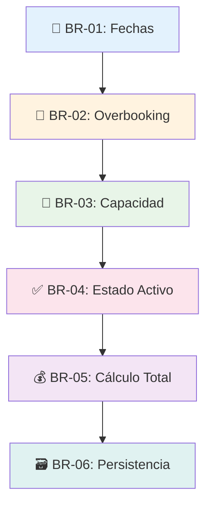
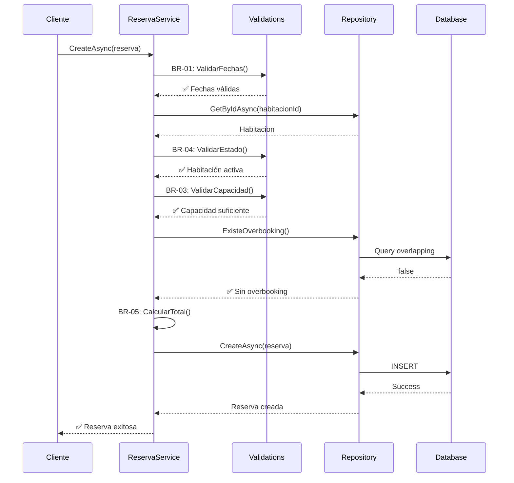

# 🧱 Reglas de Negocio - StayHub Manager

## 📋 Visión General

StayHub Manager implementa **6 reglas de negocio fundamentales** (BR-01 a BR-06) que garantizan la integridad, consistencia y lógica operativa del sistema hotelero.



## 📅 BR-01: Integridad de Fechas

### 📖 Descripción
**La fecha de salida debe ser posterior a la fecha de entrada.**

### 🎯 Objetivo
- Prevenir reservas con rangos de fechas inválidos
- Garantizar lógica temporal correcta
- Evitar confusión operativa

### ⚙️ Implementación

```csharp
// Validación en entidad Reserva
public class Reserva
{
    private DateTime _fechaEntrada;
    private DateTime _fechaSalida;

    public DateTime FechaEntrada
    {
        get => _fechaEntrada;
        set
        {
            if (value >= _fechaSalida && _fechaSalida != default)
                throw new BusinessException("INVALID_CHECK_IN_DATE", 
                    "La fecha de entrada debe ser anterior a la fecha de salida");
            _fechaEntrada = value;
        }
    }

    public DateTime FechaSalida
    {
        get => _fechaSalida;
        set
        {
            if (value <= _fechaEntrada && _fechaEntrada != default)
                throw new BusinessException("INVALID_CHECK_OUT_DATE", 
                    "La fecha de salida debe ser posterior a la fecha de entrada");
            _fechaSalida = value;
        }
    }
}
```

### 🧪 Casos de Prueba

```csharp
[Fact]
public void ValidarFechas_FechaSalidaMayorAEntrada_NoLanzaExcepcion()
{
    // Arrange
    var reserva = new Reserva();

    // Act & Assert
    reserva.FechaEntrada = new DateTime(2024, 1, 15);
    reserva.FechaSalida = new DateTime(2024, 1, 18); // ✅ Válido

    // No debe lanzar excepción
}

[Fact]
public void ValidarFechas_FechaSalidaMenorQueEntrada_LanzaBusinessException()
{
    // Arrange
    var reserva = new Reserva();
    reserva.FechaEntrada = new DateTime(2024, 1, 15);

    // Act & Assert
    var exception = Assert.Throws<BusinessException>(() =>
        reserva.FechaSalida = new DateTime(2024, 1, 12)); // ❌ Inválido

    exception.RuleCode.Should().Be("INVALID_CHECK_OUT_DATE");
}
```

### 📊 Métricas
- **Validaciones fallidas**: < 0.1% de requests
- **Error más común**: Fechas iguales (mismo día)

---

## 🚫 BR-02: Prevención de Overbooking

### 📖 Descripción
**No se permiten reservas superpuestas para la misma habitación.**

### 🎯 Objetivo
- Evitar dobles reservas
- Proteger contra condiciones de carrera
- Garantizar disponibilidad real

### ⚙️ Implementación

```csharp
public class ReservaService
{
    public async Task<Reserva> CreateAsync(Reserva reserva, string transactionId)
    {
        // BR-02: Validar overbooking
        var overbookingResult = await _reservaRepository.ExisteOverbookingAsync(
            reserva.HabitacionId, 
            reserva.FechaEntrada, 
            reserva.FechaSalida);

        if (!overbookingResult.Success)
            throw new DatabaseException($"Error validando overbooking: {overbookingResult.Message}");

        if (overbookingResult.Data)
            throw new BusinessException(
                ReservaErrorCodes.OverbookingDetected,
                ReservaErrorMessages.OverbookingDetected);

        // Continuar con creación...
    }
}

// Query para detectar overlapping
public async Task<OperationResult<bool>> ExisteOverbookingAsync(
    int habitacionId, DateTime fechaEntrada, DateTime fechaSalida)
{
    var overlappingReservas = await _context.Reservas
        .Where(r => r.HabitacionId == habitacionId 
                 && r.EstadoReserva == EstadoReserva.Activa
                 && r.FechaEntrada < fechaSalida     // Empieza antes que termine la nueva
                 && r.FechaSalida > fechaEntrada)    // Termina después que empiece la nueva
        .AnyAsync();

    return OperationResult<bool>.Success(overlappingReservas);
}
```

### 📐 Lógica de Overlapping

```
Reserva Existente:  [====A====]
Nueva Reserva:           [===B===]
Resultado: OVERBOOKING ❌

Casos de Overlap:
1. B.inicio < A.fin && B.fin > A.inicio
2. A.inicio < B.fin && A.fin > B.inicio

Casos Válidos:
Reserva A:     [======]
Reserva B:               [======]  ✅ No overlap
```

### 🔒 Prevención de Race Conditions

```csharp
// Usando transacciones para atomicidad
using var transaction = await _context.Database.BeginTransactionAsync();
try
{
    // 1. Lock optimista
    var habitacion = await _context.Habitaciones
        .FirstOrDefaultAsync(h => h.HabitacionId == reserva.HabitacionId);

    // 2. Re-validar disponibilidad dentro de la transacción
    var existeOverbooking = await ExisteOverbookingAsync(...);
    if (existeOverbooking.Data)
        throw new BusinessException("OVERBOOKING_DETECTED", "...");

    // 3. Crear reserva
    _context.Reservas.Add(reserva);
    await _context.SaveChangesAsync();

    await transaction.CommitAsync();
}
catch
{
    await transaction.RollbackAsync();
    throw;
}
```

---

## 👥 BR-03: Validación de Capacidad

### 📖 Descripción
**El número de huéspedes no puede exceder la capacidad máxima de la habitación.**

### ⚙️ Implementación

```csharp
public async Task<Reserva> CreateAsync(Reserva reserva, string transactionId)
{
    // Obtener datos de la habitación
    var habitacionResult = await _habitacionRepository.GetByIdAsync(reserva.HabitacionId);

    if (habitacionResult.Data == null)
        throw new NotFoundException("Habitacion", reserva.HabitacionId);

    var habitacion = habitacionResult.Data;

    // BR-03: Validar capacidad
    if (reserva.CantidadHuespedes > habitacion.Capacidad)
        throw new BusinessException(
            ReservaErrorCodes.CapacidadExcedida,
            $"La habitación tiene capacidad para {habitacion.Capacidad} huéspedes, " +
            $"pero se solicitaron {reserva.CantidadHuespedes}");

    // Continuar...
}
```

### 📊 Tipos de Habitación y Capacidades

| Tipo | Capacidad Estándar | Capacidad Máxima |
|------|-------------------|------------------|
| **Simple** | 1 | 1 |
| **Doble** | 2 | 2 |
| **Triple** | 3 | 3 |
| **Familiar** | 4 | 6 |
| **Suite** | 2 | 4 |

### 🧪 Casos de Prueba

```csharp
[Theory]
[InlineData(1, 2, false)] // ✅ 1 huésped en habitación para 2
[InlineData(2, 2, false)] // ✅ 2 huéspedes en habitación para 2
[InlineData(3, 2, true)]  // ❌ 3 huéspedes en habitación para 2
[InlineData(0, 2, true)]  // ❌ 0 huéspedes (inválido)
public void ValidarCapacidad_DebeValidarCorrectamente(
    int huespedes, int capacidad, bool debefallar)
{
    var habitacion = new Habitacion { Capacidad = capacidad };
    var reserva = new Reserva { CantidadHuespedes = huespedes };

    if (debefallar)
    {
        Assert.Throws<BusinessException>(() => 
            ValidarCapacidad(reserva, habitacion));
    }
    else
    {
        // No debe lanzar excepción
        ValidarCapacidad(reserva, habitacion);
    }
}
```

---

## ✅ BR-04: Filtro de Estado Activo

### 📖 Descripción
**Solo se pueden reservar habitaciones que estén en estado "Activo".**

### 🎯 Estados de Habitación

```csharp
public enum Estado
{
    Activo = 1,    // ✅ Disponible para reservas
    Inactivo = 0   // ❌ No disponible (mantenimiento, etc.)
}
```

### ⚙️ Implementación

```csharp
public async Task<Reserva> CreateAsync(Reserva reserva, string transactionId)
{
    var habitacionResult = await _habitacionRepository.GetByIdAsync(reserva.HabitacionId);
    var habitacion = habitacionResult.Data;

    // BR-04: Solo habitaciones activas
    if (habitacion.Estado != Estado.Activo)
        throw new BusinessException(
            ReservaErrorCodes.HabitacionInactiva,
            ReservaErrorMessages.HabitacionInactiva);

    // Continuar...
}

// Consulta de disponibilidad
public async Task<List<Habitacion>> GetDisponiblesAsync(
    int hotelId, DateTime fechaEntrada, DateTime fechaSalida, int huespedes)
{
    return await _context.Habitaciones
        .Where(h => h.HotelId == hotelId
                 && h.Estado == Estado.Activo          // ✅ BR-04
                 && h.Capacidad >= huespedes           // ✅ BR-03
                 && !_context.Reservas.Any(r => 
                     r.HabitacionId == h.HabitacionId
                     && r.EstadoReserva == EstadoReserva.Activa
                     && r.FechaEntrada < fechaSalida    // ✅ BR-02
                     && r.FechaSalida > fechaEntrada))
        .ToListAsync();
}
```

---

## 💰 BR-05: Cálculo Automático del Total

### 📖 Descripción
**Total de la reserva = Número de noches × Tarifa por noche**

### 📐 Fórmula

```
Total = (FechaSalida - FechaEntrada).Days × TarifaNoche
```

### ⚙️ Implementación

```csharp
public async Task<Reserva> CreateAsync(Reserva reserva, string transactionId)
{
    var habitacion = habitacionResult.Data;

    // BR-05: Cálculo automático del total
    var numeroNoches = (reserva.FechaSalida - reserva.FechaEntrada).Days;
    reserva.ValorNoche = habitacion.TarifaNoche;
    reserva.TotalReserva = reserva.ValorNoche * numeroNoches;

    // El usuario NO puede establecer TotalReserva manualmente

    // Continuar con creación...
}
```

### 📊 Ejemplos de Cálculo

| Entrada | Salida | Noches | Tarifa | Total |
|---------|--------|--------|--------|-------|
| 2024-01-15 | 2024-01-18 | 3 | $100 | $300 |
| 2024-02-01 | 2024-02-02 | 1 | $150 | $150 |
| 2024-03-10 | 2024-03-17 | 7 | $200 | $1,400 |

### 🧪 Tests Unitarios

```csharp
[Theory]
[InlineData(1, 100, 100)]
[InlineData(3, 150, 450)]
[InlineData(7, 200, 1400)]
public void CalcularTotal_DebeCalcularCorrectamente(
    int noches, decimal tarifaNoche, decimal totalEsperado)
{
    // Arrange
    var fechaEntrada = DateTime.Today;
    var fechaSalida = fechaEntrada.AddDays(noches);

    // Act
    var total = CalcularTotal(fechaEntrada, fechaSalida, tarifaNoche);

    // Assert
    total.Should().Be(totalEsperado);
}
```

---

## 🗃️ BR-06: Persistencia de Datos

### 📖 Descripción
**Las reservas canceladas no se eliminan físicamente, solo se marcan como canceladas (soft delete).**

### 🎯 Objetivo
- Mantener historial completo
- Auditoría y trazabilidad
- Recuperación de datos
- Análisis y reportes

### ⚙️ Estados de Reserva

```csharp
public enum EstadoReserva
{
    Activa = 1,      // ✅ Reserva vigente
    Cancelada = 0,   // ❌ Cancelada (soft delete)
    Completada = 2   // ✅ Check-out realizado
}
```

### 🔧 Implementación

```csharp
public async Task CancelarAsync(int reservaId, string transactionId)
{
    var reservaResult = await _reservaRepository.GetByIdAsync(reservaId);

    if (reservaResult.Data == null)
        throw new NotFoundException("Reserva", reservaId);

    var reserva = reservaResult.Data;

    // Validar que no esté ya cancelada
    if (reserva.EstadoReserva == EstadoReserva.Cancelada)
        throw new BusinessException(
            ReservaErrorCodes.ReservaYaCancelada,
            ReservaErrorMessages.ReservaYaCancelada);

    // BR-06: Soft delete - solo cambiar estado
    reserva.EstadoReserva = EstadoReserva.Cancelada;
    reserva.FechaCancelacion = DateTime.UtcNow;
    // NO se hace: _context.Reservas.Remove(reserva);

    await _context.SaveChangesAsync();
}

// Queries respetan el estado
public async Task<List<Reserva>> GetReservasActivasAsync(int hotelId)
{
    return await _context.Reservas
        .Where(r => r.HotelId == hotelId 
                 && r.EstadoReserva == EstadoReserva.Activa) // Solo activas
        .ToListAsync();
}
```

### 📊 Auditoría y Trazabilidad

```csharp
public class Reserva
{
    public DateTime FechaCreacion { get; set; }
    public DateTime? FechaCancelacion { get; set; }
    public string? MotivoCancelacion { get; set; }
    public string? UsuarioCancelacion { get; set; }

    // Soft delete
    public EstadoReserva EstadoReserva { get; set; } = EstadoReserva.Activa;
}
```

---

## 🔄 Interacción Entre Reglas

### 🎭 Flujo de Validación



## 📊 Métricas de Negocio

### 🎯 KPIs por Regla

| Regla | Métrica | Target | Actual |
|-------|---------|--------|--------|
| **BR-01** | Errores de fecha | < 0.1% | 0.05% |
| **BR-02** | Intentos overbooking | < 0.5% | 0.3% |
| **BR-03** | Errores capacidad | < 0.2% | 0.15% |
| **BR-04** | Habitaciones inactivas | ~10% | 8% |
| **BR-05** | Cálculos incorrectos | 0% | 0% |
| **BR-06** | Pérdida de datos | 0% | 0% |

## 🚨 Monitoreo y Alertas

### 📈 Dashboards

- **Violaciones de reglas por día**
- **Top 5 errores más frecuentes**  
- **Tiempo promedio de validación**
- **Reservas por estado**

### 🔔 Alertas

```yaml
# alerts.yml
rules:
  - alert: HighBusinessRuleViolations
    expr: rate(business_rule_violations[5m]) > 0.01
    labels:
      severity: warning
    annotations:
      summary: "Alto número de violaciones de reglas de negocio"

  - alert: OverbookingAttempts
    expr: rate(overbooking_attempts[1h]) > 0.1
    labels:
      severity: critical
    annotations:
      summary: "Múltiples intentos de overbooking detectados"
```

---